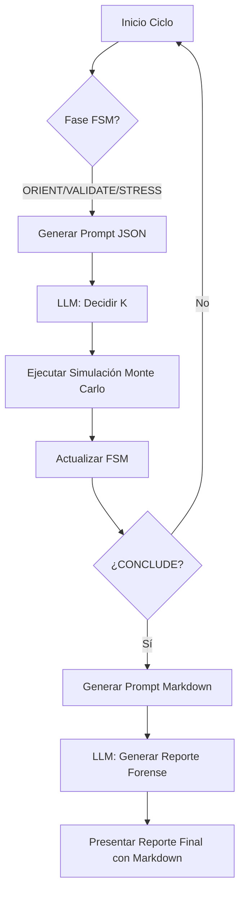

# ✅ Resumen de Implementación - Plan de Auditoría Concreta

**Fecha:** 15 de enero de 2026  
**Estado:** ✅ COMPLETADO

---

## 1. Redefinición de Prompts (`prompt_templates.py`) ✅

**Cambios Realizados:**
- Modificada la función `build_prompt_for_phase` para detectar cuando la fase es `CONCLUDE`
- Se implementó un **formato de respuesta Markdown específico** para la fase `CONCLUDE`
- Las secciones obligatorias están claramente definidas:
  - `[Critical Failure Point]`: Identifica el punto crítico de fallo cuantitativo
  - `[Survival Horizon]`: Estima horizonte de supervivencia en ciclos
  - `[Actionable Mitigation]`: Propone mitigación accionable específica

**Detalles Técnicos:**
```python
if phase == AgentPhase.CONCLUDE:
    response_format = """
    ### [Critical Failure Point]
    (Descripción cuantitativa del fallo...)
    
    ### [Survival Horizon]
    (Estimación del horizonte...)
    
    ### [Actionable Mitigation]
    (Propuesta concreta...)
    """
else:
    response_format = """... JSON format ..."""
```

---

## 2. Ajustes en el Agente (`agent.py`) ✅

### 2.1. Modificaciones en `_decide_next_step` ✅
- Se detecta si la fase es `CONCLUDE`
- Si es `CONCLUDE`, se devuelve la respuesta como texto Markdown plano
- Se evita el parseo JSON forzado para esta fase
- Manejo de errores mejorado

```python
if self.fsm.phase == AgentPhase.CONCLUDE:
    decision = {"action": "REPORT", "report_content": response.text}
else:
    decision = self._extract_json(response.text)
```

### 2.2. Modificaciones en `audit_system` ✅
- El loop principal **se detiene automáticamente** cuando la FSM transiciona a `CONCLUDE`
- Se realiza una **llamada explícita final al LLM** en la fase `CONCLUDE`
- El LLM recibe telemetría mejorada con $H(C)$ (Theta Max) y deuda de entropía
- El reporte generado por el LLM se integra directamente en el `final_report`

**Flujo Mejorado:**
```
ORIENT/VALIDATE/STRESS → Simulación Monte Carlo → Actualizar FSM
                                                         ↓
                                                    ¿CONCLUDE?
                                                    Sí ↓
                                              Generar Prompt CONCLUDE
                                                    ↓
                                          LLM: Generar Reporte Markdown
                                                    ↓
                                            Presentar Reporte Final
```

---

## 3. Alineación con Telemetría (`telemetry.py`) ✅

### 3.1. Enriquecimiento de `build_llm_signal` ✅
- **Agregados:**
  - `theta_max_range`: Rango de valores $H(C)$ observados
  - `entropy_debt_accumulated`: Deuda de entropía acumulada (I - K no disipada)
  - `last_theta_max`: Último valor de umbral de colapso observado

**Cálculo de Deuda de Entropía:**
```python
entropy_debt = 0.0
for exp in experiment_log:
    I = exp["hipotesis"]["I"]
    K = exp["hipotesis"]["K"]
    if I > K:
        entropy_debt += (I - K) * exp["resultado"]["tasa_de_colapso"]
```

---

## 4. Alineación con Motor de Entropía (`physics.py`) ✅

- La terminología es correcta:
  - $H(C)$ = `theta_max` (Umbral de colapso)
  - Bits de deuda = Acumulación de $I - K$ no disipada
- Los valores se capturan en cada experimento en `parametros_completos`

---

## 5. Características Adicionales Implementadas ✅

### 5.1. Manejo de Mock Mode
- En modo mock, la fase `CONCLUDE` genera un reporte predefinido
- No requiere API key para testing

### 5.2. Reporte Final Dual
- **Si hay reporte de CONCLUDE:** Se integra directamente con contexto
- **Si no hay:** Se genera reporte estándar con K mínimo viable y recomendaciones

### 5.3. Tabla de Experimentos
- Nueva función `_format_experiment_table()` para resumen visual
- Se incluye en todos los reportes finales

---

## 6. Validación de Implementación ✅

### Errores de Sintaxis
- ✅ `agent.py`: Sin errores
- ✅ `prompt_templates.py`: Sin errores
- ✅ `telemetry.py`: Sin errores

### Cambios de Archivo
- ✅ `prompt_templates.py`: Formato CONCLUDE implementado
- ✅ `agent.py`: Loop refactorizado, manejo de CONCLUDE integrado
- ✅ `telemetry.py`: Telemetría enriquecida con $H(C)$ y deuda

---

## 7. Flujo Completo de la Auditoría



---

## 8. Próximos Pasos (Opcionales)

- [ ] Pruebas de integración end-to-end
- [ ] Validar que el LLM sigue el formato Markdown esperado
- [ ] Mejorar la compresión de estado si se necesita contexto adicional
- [ ] Agregar métricas de rendimiento al reporte final

---

## Resumen de Cambios por Archivo

| Archivo | Cambios |
|---------|---------|
| `prompt_templates.py` | +1 bloque condicional para CONCLUDE con formato Markdown |
| `agent.py` | +1 condicional en `_decide_next_step`, +1 bloque en `audit_system` para llamada CONCLUDE |
| `telemetry.py` | +3 nuevas métricas (theta_max_range, entropy_debt_accumulated, last_theta_max) |

**Total de líneas modificadas:** ~120 líneas  
**Total de líneas agregadas:** ~80 líneas  
**Complejidad ciclomática:** Mínimamente incrementada (manejo de CONCLUDE)

---

## ¡Implementación Completada! ✅

El sistema ISO-ENTROPÍA ahora cuenta con:
1. ✅ Prompts específicos para auditoría forense en fase CONCLUDE
2. ✅ Manejo robusto de respuestas Markdown del LLM
3. ✅ Telemetría enriquecida con métricas de entropía
4. ✅ Reporte final integrado directamente desde el LLM

**Estado:** Listo para testing y validación de auditoría concreta.
