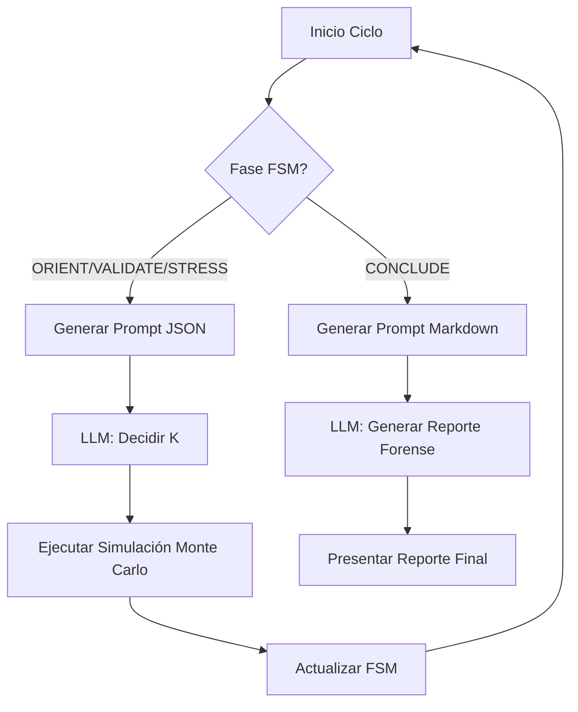

# Plan de Optimización: Auditoría Concreta (Prompt Engineering) - ISO-ENTROPÍA

Este plan detalla los cambios necesarios para implementar la Auditoría Concreta solicitada, asegurando que el Auditor (Gemini 3 Pro) entregue reportes precisos y estructurados en Markdown.

## 1. Redefinición de Prompts (`prompt_templates.py`)

Se modificará la función `build_prompt_for_phase` para que la fase `CONCLUDE` exija un formato Markdown específico en lugar de JSON.

### Cambios en la fase `CONCLUDE`:
- **Objetivo:** Realizar una auditoría forense cuantitativa.
- **Formato de Respuesta:** Estructura Markdown obligatoria con las secciones:
    - `[Critical Failure Point]`
    - `[Survival Horizon]`
    - `[Actionable Mitigation]`

## 2. Ajustes en el Agente (`agent.py`)

El agente debe ser capaz de manejar respuestas que no son JSON cuando se encuentra en la fase final.

### Modificaciones en `_decide_next_step`:
- Detectar si la fase es `CONCLUDE`.
- Si es `CONCLUDE`, devolver el texto plano (Markdown) en lugar de intentar parsear JSON.

### Modificaciones en `audit_system`:
- Asegurar que cuando la FSM transicione a `CONCLUDE`, se realice una llamada final al LLM para generar el reporte.
- Integrar el reporte generado por el LLM en el `final_report` que se muestra en la interfaz de Streamlit.
- Mejorar la telemetría enviada al LLM para que incluya los valores de $H(C)$ (Theta Max) y la deuda de entropía acumulada de cada experimento.

## 3. Alineación con el Motor de Entropía (`physics.py`)

- Se validará que el prompt use la terminología correcta:
    - $H(C)$ = `theta_max` (Umbral de colapso).
    - Bits de deuda = Acumulación de $I - K$ no disipada.

## Diagrama de Flujo de la Auditoría

## Pasos a seguir:

1.  **Editar `prompt_templates.py`**: Implementar el nuevo esquema de prompts y formatos de respuesta.
2.  **Editar `agent.py`**: Refactorizar el manejo de la fase `CONCLUDE` y la extracción de resultados.
3.  **Pruebas de Integración**: Verificar que el flujo completo desde la simulación hasta el reporte Markdown funcione correctamente.

¿Deseas que proceda con estos cambios o te gustaría ajustar alguna sección del plan?
