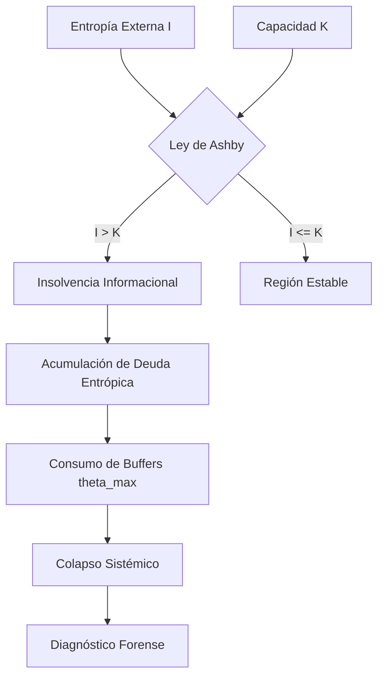

# Plan de Implementación: Diagnóstico de Insolvencia Informacional

Este plan detalla la transformación del simulador Iso-Entropy de una herramienta predictiva a una plataforma de diagnóstico forense de insolvencia informacional, alineada con la Ley de Variedad Requerida de Ashby.

## 1. Refinamiento del Motor Físico (`src/core/physics.py`)
- **Métrica de Insolvencia Informacional (II):** Definida como el ratio persistente $I/K$. Si $II > 1$, el sistema es insolvente por diseño.
- **Deuda Entrópica Residual ($D_e$):** Capturar el valor final de la deuda al momento del colapso o al final del tiempo de simulación.
- **Ecuación Dinámica:** Asegurar que la acumulación no lineal refleje que aumentar $K$ sin superar $I$ solo retrasa el colapso (compra tiempo).

## 2. Evolución de la Inteligencia del Agente (`src/core/agent.py` & `src/core/prompt_templates.py`)
- **Razonamiento de Ashby:** El agente debe evaluar si la variedad del regulador ($K$) es suficiente para la variedad del entorno ($I$).
- **Detección de Insolvencia Estructural:** Si tras los intentos forzados de aumentar $K$ el colapso persiste, el agente debe declarar "Insolvencia Estructural" en lugar de simplemente "Frágil".
- **Reporte Forense:** Incluir una sección específica sobre "Deuda Entrópica Acumulada" y "Violación de la Ley de Ashby".

## 3. Visualización y UI (`src/ui/app.py`)
- **Indicador de Insolvencia:** Un semáforo o medidor que muestre el ratio $I/K$.
- **Gráfica de Deuda:** Visualizar cómo la deuda crece incluso cuando se intenta optimizar la eficiencia.

## 4. Documentación Teórica (`docs/technical/INSOLVENCIA_INFORMACIONAL.md`)
- Explicar por qué el colapso es determinista bajo ciertas configuraciones.
- Definir la "Insolvencia Informacional" como la incapacidad de procesar variedad.

